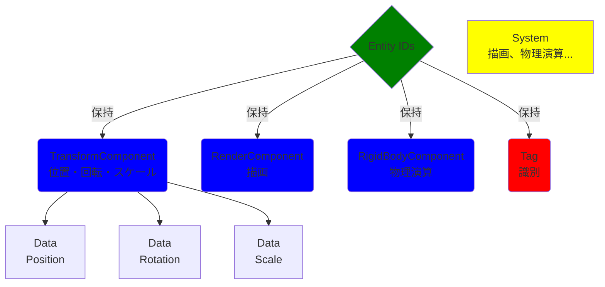

<div align="center">
  
# DirectX ECSベースプロジェクト チーム開発ガイド
  
</div>

---

本ドキュメントは、DirectX 3DベースプロジェクトにおけるEntity-Component-System (ECS)アーキテクチャの概要、実装ガイド、及びチーム開発のガイドラインをまとめたものです。

開発に参加する全てのメンバーは、このドキュメントを熟読し、プロジェクトの規約を遵守してください。

---

<div align="center">
  
## 目次

</div>

<details open>
<summary>展開/折りたたみ</summary>

### 1. 基本情報
- [プロジェクト概要](#プロジェクト概要)
- [技術スタック](#技術スタック)
- [環境構築](#環境構築)

### 2. ECSアーキテクチャについて
- [ECSを図解](#ecsを図解)
  - [Entity（エンティティ）](#entityエンティティ)
  - [Component（コンポーネント）](#componentコンポーネント)
  - [System（システム）](systemシステム)
  - [ECSコアの動作原理（Coordinator）](#ecsコアの動作原理coordinator)

### 3. 実装ガイド
- [コンポーネントの作り方](#コンポーネントの作り方)
- [システムの作り方](#システムの作り方)
- [システムの登録とシグネチャの設定方法](#システムの登録とシグネチャの設定方法)
- [エンティティの作成（詳細）](#エンティティの作成詳細)

### 4. 実践
- [実践例](#実践例)
  - [System内のComponentデータへのアクセス](#1-system内のcomponentデータへのアクセス)
  - [System間の連携パターン（イベント・メッセージング）](#2-system間の連携パターンイベントメッセージング)
  - [Entityの動的な操作（Componentの追加・削除）](#3-entityの動的な操作componentの追加削除)
  - [エンティティの削除方法](#4-エンティティの削除方法)

### 5. コーディング規約
- [命名規約](#命名規約)
- [ファイル構成](#ファイル構成)

### 6. チーム開発するにあたって
- [ファイル編集ルール](#ファイル編集ルール)
- [コアな型定義（参照）](#コアな型定義参照)

### 7. GitHubの使い方
- [重要な用語](#重要な用語)
- [SourceTreeを使った共同制作フロー](#sourcetreeを使った共同制作フロー)
- [コミットメッセージ規約（Commit Message Convention）](#コミットメッセージ規約commit-message-convention)

### 8. チェックリスト
- [作業前](#作業前)
- [作業後](#作業後)
- [参加メンバー 編集チェック](#参加メンバー-編集チェック)

</details>

---

## 1. 基本情報

### プロジェクト概要

本プロジェクトは、DirectX11を使用した3Dグラフィックスアプリケーションの基盤となるフレームワークです。

ゲームオブジェクトのロジックとデータを分離し、柔軟性とパフォーマンスの向上を目指すために、**ECS（Entity-Component-System）アーキテクチャ**を採用しています。

---

<table>
<tr>
<td>
      
### 技術スタック

|項目|内容|備考|
|-|-|-|
|**名称**|DirectX_3D_Base||
|**プラットフォーム**|Windows (PC)||
|**グラフィックスAPI**|DirectX11 (プロジェクト設定依存)|3D描画の基盤です。|
|**言語**|C++14|最新のC++標準機能（スマートポインタ、テンプレートなど）を積極的に使用します。|
|**ECSコア**|カスタム実装 (Coordinatorパターン)|ComponentManager, EntityManager, SystemManagerから構成されます。|
|**外部ライブラリ**|DirectXTex, DirectXMath, Assimp|3D数学演算及びモデルファイル（FBXなど）のローディングに使用します。|

</td>
</tr>
</table>
<table>
<tr>
<td>

### 環境構築

|項目|推奨設定|備考|
|-|-|-|
|**OS**|Windows 10/11|開発環境の標準OS|
|**IDE**|Visual Studio 2022|C++開発環境 (C++ Desktop Developmentワークロード必須)|
|**SDK**|Windows SDK (最新版)||
|**前提条件**|Git, GitHubアカウント|バージョン管理に必須|

> 環境構築に関する具体的な手順（Visual Studioでのビルド設定や依存ライブラリのパス設定など）については、別途詳細な初期設定ドキュメントを参照してください。

</td>
</tr>
</table>

---

## 2. ECSアーキテクチャについて

ECSは、ゲームオブジェクトを構成するデータとロジックを厳密に分離するための設計思想です。


### ECSを図解



### Entity（エンティティ）
```
・定義：ゲームワールドに存在する一意の識別子（ID）のみを持つものです。
・役割：データのコンテナ（入れ物）として機能し、自身はロジックを持ちません。Entityの振る舞いは、付与されたComponentの組み合わせ（Signature）によって決定されます。
・実装：ECS::EntityID (uint32_tなど) [cite: DirectX_3D_Base/Include/ECS/Types.h] として実装されています。
```

### Component（コンポーネント）
```
・定義：Entityのデータ（状態）のみを保持する単純な構造体です。
・役割：Entityの属性（位置、体力、入力状態など）を定義します。メンバー変数のみで構成され、ロジック（複雑なメソッド）は含めません。
・実践例：TransformComponentが位置、回転、スケールデータを保持します [cite: DirectX_3D_Base/Include/ECS/Components/TransformComponent.h]。
```

### System（システム）
```
・定義：特定のComponentの組み合わせを持つEntity集合（Query）に対してロジック（処理）を実行するクラスです。
・役割：ゲームのルール、物理演算（PhysicsSystem）、描画（RenderSystem） [cite: DirectX_3D_Base/Include/ECS/Systems/RenderSystem.h]、入力処理など、Entityの状態を変化させる全てのロジックを担当します。
・実装：ECS::Systemクラスを継承し、Coordinatorを通してComponentデータにアクセスします。
```

### ECSコアの動作原理（Coordinator）

> ECSの中心である`Coordinator`は、3つのマネージャー（Entity, Component, System）へのアクセスを一元管理するFacade（窓口）です。

|メソッド|処理内容|連携するマネージャー|
|:-:|:-|:-|
|`CreateEntity()`|新しいIDを割り当てる。|EntityManager|
|`AddComponent<T>()`|EntityにComponentデータ領域を確保し、EntityのSignatureを更新。|ComponentManager, EntityManager|
|`RemoveComponent<T>()`|Componentデータを削除し、EntityのSignatureを更新。|ComponentManager, EntityManager|
|`GetComponent<T>()`|Componentの参照を返す。|ComponentManager|
|`EntitySignatureChanged()`|**重要**：EntityのSignatureが更新された際、SystemManagerに通知し、SystemのEntityリストを更新トリガーする。|SystemManager|

---

## 3. 実装ガイド

### コンポーネントの作り方

1. **ヘッダーファイルを作成**：`DirectX_3D_Base/Include/ECS/Components`に`[ComponentName]Component.h`を作成。
2. **構造体を定義**：`struct`でデータ構造を定義します。コンストラクタでデフォルト値の設定を推奨します。

```cpp
/**
 * @struct  TransformComponent
 * @brief   Entityの移動・回転・スケール情報（ワールド座標返還データ）
 */
struct TransformComponent
{
    DirectX::XMFLOAT3 position;  ///< ワールド座標系における位置（X, Y, Z）
    DirectX::XMFLOAT3 rotation;  ///< オイラー角での回転量（ラジアン）
    DirectX::XMFLOAT3 scale;     ///< 各軸のスケール（大きさ）

    // コンストラクタ
    TransformComponent(
        DirectX::XMFLOAT3 pos = DirectX::XMFLOAT3(0.0f, 0.0f, 0.0f),
        DirectX::XMFLOAT3 rot = DirectX::XMFLOAT3(0.0f, 0.0f, 0.0f),
        DirectX::XMFLOAT3 scale = DirectX::XMFLOAT3(1.0f, 1.0f, 1.0f)
    )
        : position(pos)
        , rotation(rot)
        , scale(scale)
    {}
};
```

3. **登録マクロを記述**：ファイルの最後に以下のマクロを記述します。

```cpp
#include "ECS/ComponentRegistry.h"
REGISTER_COMPONENT_TYPE(YourNewComponent)
```

### システムの作り方

1. **ヘッダーファイルを作成**:`DirectX_3D_Base/Include/ECS/Systems/`に`[SystemName]System.h`を作成。
2. **Systemクラスを定義**:`public ECS::System`を継承します。
3. `Init`を実装：`Coordinator`へのポインタを必ず保持します。

```cpp
class YourNewSystem
  : ECS::System
{
public:  /* 外部関数 */
  void Init(ECS::Coordinator* coordinator) override
  {
    m_coordinator = coordinator;
  }

  void Update(float deltaTime);  // ロジック実装メソッド

private:  /* 内部変数 */
  ECS::Coordinator* m_coordinator;
};
```

### システムの登録とシグネチャの設定方法

Systemの登録は、シーン初期化関数（`ECSInitializer::RegisterSystemsAndSetSignatures()`）から`ECSInitializer.h`のマクロを用いて実行します。

- **コンポーネントの登録方法**：Componentファイルで`REGISTER_COMPONENT_TYPE`を使用することで、自動的に登録されます。特別手動登録処理は不要です。
- **システムの登録とシグネチャの設定方法**：`REGISTER_SYSTEM_AND_INIT`マクロを使用することで、システム登録とシグネチャ設定、初期化を同時に行います。

```cpp
// @file  ECSInitializer.cpp
// ECSInitializer::RegisterSystemsAndSetSignatures()内

// シグネチャ：TransformComponent と RenderComponent を持つEntityを処理対象とする。
// --- RenderSystem ---
REGISTER_SYSTEM_AND_INIT(
  /* Coordinator  */  m_coordinator,
  /* System       */  RenderSystem,
  /* Components   */  TransformComponent, RenderComponent
);
```

### エンティティの作成（詳細）
Entityの作成には、Componentの初期値を同時に渡す一括追加形式を推奨します。
1. **エンティティIDの取得**：`Coordinator::CreateEntity()`で新しいIDが割り当てられます。
2. **Componentの初期化と付与**
   1. 一括生成 + 一括追加：推奨
   
    ```cpp
    ECS::EntityID newEntity = m_coordinator->CreateEntity(
      TransformComponent(
        /* Position  */  XMFLOAT3( 10.0f, 0.0f, 5.0f ),
        /* Rotation  */  XMFLOAT3( 0.0f, 0.0f, 0.0f),
        /* Scale     */  XMFLOAT3( 1.0f, 1.0f, 1.0f),
      ),
      RenderComponent(
        /* MeshType  */  MESH_BOX,
        /* Color     */  XMFLOAT4(0.8f, 0.8f, 0.8f, 1.0f)
      )
    );
    // Componentが付与されると、自動的に該当するSystemに登録されます。
    ```

   2. 個別追加：（動的な追加/削除や、Componentが複雑な初期化を必要とする場合に利用）


    ```cpp
    ECS::EntityId entity = m_coordinator->CreateEntity();
    m_coordinator->AddComponent<CameraComponent>(entity, CameraComponent(/* 設定値 */));
    ```

---

## 4. 実践

### 実践例

### 1. System内のComponentデータへのアクセス

Systemは、自身が処理すべきEntityリスト（`m_entities`）をループし、Coordinatorから必要なComponentの参照を取得します。

```cpp
// YourNewSystem::Update(float deltaTime) の内部

for (auto const& entity : m_entities)
{
  // Componentの参照を取得（非 const 参照で書き換え可能）
  TransformComponent& transform = m_coordinator->GetComponent<TransformComponent>(entity);

  // データの更新
  transform.Position.x += 1.0f * deltaTime;
}
```

### 2. System間の連携パターン（イベント・メッセージング）

ECSではSystem間の直接的な依存関係を避けるため、Coordinatorを通じた間接的な連携（イベント/メッセージング）が推奨されます

- **パターン１：グローバルステート / シングルトン Component：**
  - 例：`GameStatusComponent`（スコア、ゲーム状態）を持つEntityを一つだけ作成し、全てのSystemがCoordinator経由でこのComponentを読み書きします。
- **パターン２：イベントキュー（推奨）**
  - 例：`CollisionSystem`が衝突を検出した場合、Componentを直接変更する代わりに、`EventManager`を通して「`EntityA`が`EntityB`に衝突した」というイベントをキューに積みます。
  - 別のSystem（`DamageSystem`など）がそのイベントを読み取り、適切なロジック（`HealthComponent`の値を減らすなど）を実行します。


### 3. Entityの動的な操作（Componentの追加・削除）

ゲームプレイ中にEntityの振る舞いを変更する場合に使用します。
- Componentの追加：

```cpp
m_coordinator->AddComponent<NewBehaviorComponent>(entity, NewBehaviorComponent(/* 初期値 */));
// このEntityは、NewBehaviorComponentを要求するSystemの処理対象になります。
```

- Componentの削除：

```cpp
m_coordinator->RemoveComponent<NewBehaviorComponent>(entity);
// このEntityは、NewBehaviorComponentを要求するSystemの処理対象から外れます。
```

### 4. エンティティの削除方法

不要になったEntityは、必ずCoordinator::DestoryEntityを使って破棄し、リソースとIDを解放します。

```cpp
m_coordinator->DestoryEntity(entity);
// この呼び出しにより、Systemからの登録解除、Componentデータの削除、EntityIDの再利用が行われます。
```

---

## 5. コーディング規約

### 命名規約

|要素|命名規約|例|備考|
|-|-|-|-|
|クラス/構造体/列挙型|PascalCase|`Coordinator`, `TransformComponent`, `RenderSystem`||
|関数/メソッド|PascalCase|`Init`, `CreateEntity`, `SetSignature`||
|マクロ/定数|ALL_CAPS_WITH_UNDERSCORES|`MAX_ENTITIES`, `REGISTER_SYSTEM_AND_INIT`||
|メンバ変数|camelCase(m_接頭語)|`m_coordinator`, `m_componentManager`|一貫性のため、`m_`を付けてください。|
|ローカル変数|camelCase|`entityID`, `deltaTime`||

### ファイル構成

- `Include/ECS/Components/`：全てのComponentのヘッダーファイル
- `Include/ECS/Systems/`：全てのSystemのヘッダーファイル
- `Source/ECS/Systems/`：全てのSystemのソースファイル（ロジック実装）
- `Source/Scene/**Scene.cpp/`：Entityの生成、Systemの登録（ゲーム固有の初期化）

---

## 6. チーム開発するにあたって

### ファイル編集ルール

プロジェクトの安定性を確保するため、ファイルの編集範囲を明確にします。

|分類|ファイル/ディレクトリ|編集ルール|
|-|-|-|
|❌触ってはいけないコアシステム|`Include/ECS/*.h` (Manager, Coordinator, Typesなど)|原則として編集禁止。ECSの根幹となる設計です。変更は極めて稀で、リーダーの承認が必要です。|
||`Include/Systems/DirectX/*.h/cpp`|グラフィックス処理。|
|✅自由に編集してよいもの|`Include/ECS/Componets/*.h`|新しいComponentの追加、既存Componentのデータ構造の修正。|
||`Include/ECS/Systems/*.h/cpp`/`Source/ECS/Systems/*.cpp`|新しいSystemの追加、既存Systemのロジック修正。|
||`Source/Scene/*.h/cpp`|ゲームロジック、Entityの初期配置、Systemの起動・停止処理。|
|⚠️要相談なもの|`Include/Systems/{Input, Model, Camera}.h/cpp`|共通のインフラレイヤーです。変更は他のメンバーに影響が出るため、PRでレビューを要請してください。|
||`Include/Scene/{Scene, SceneManager}.h/cpp`|シーンの遷移基盤。|

### コアな型定義（参照）

ECSの根幹となる型は`Include/ECS/Types.h`で定義されています。
- `EntityID`：エンティティの一意なID。
- `ComponentTypeID`：コンポーネントの型を識別するID。
- `Signature`：エンティティが持つComponentの組み合わせをビットであらわす集合（`std::bitset`）。

---

## 7. GitHubの使い方（SourceTree利用）

本プロジェクトでは、GitクライアントとしてSourceTreeの使用を推奨します。

複雑なコマンドを覚えることなく、視覚的にバージョン管理を行えます。

### 重要な用語
```
用語                意味
Repository         プロジェクトのファイルと履歴の保管庫。
Commit             ローカルでの変更履歴の記録。作業の区切りごとに細かく行います。
Branch             開発ラインから分岐させた個別の作業領域。
Push               ローカルのコミットをリモートリポジトリにアップロード。
Pull Request (PR)  ブランチをメインラインに統合するためのレビュー依頼機能。
```

### SourceTreeを使った共同制作フロー
1. **作業の開始と最新の取得**

   1. **リポジトリの選択**：SourceTreeでこのプロジェクトのリポジトリを開きます。
   
   2. **最新の取得（プル）**：ツールバーの [プル] ボタンを押し、リモート（`origin`/`develop`）の最新の変更をローカルに取り込みます。

   3. **ベースブランチへの移動**：左側のブランチリストから`develop`ブランチをダブルクリックし、チェックアウトします。

2. **フィーチャーブランチの作成**

   1. **ブランチの作成**：ツールバーの [ブランチ] ボタンを押し、新しいブランチを作成します。

      - **名前**：`feature/新機能名`や`bugfix/修正内容`などの命名規約に従います。

      - **ベース**：`develop`を選択します。

   2. **自動チェックアウト**：作成後、自動的に新しいフィーチャーブランチに移動します。

3. **コミット（変更の記録）**

   1. **変更の確認**：SourceTreeの [ファイルステータス] タブで、変更されたファイルを確認します。

   2. **インデックスに追加（ステージング）**：コミットに含めたいファイルを右クリックし [インデックスに追加] を選びます。これにより、「ステージされたファイル」のエリアに移動します。

      - *重要*：未使用のファイルやビルド生成物（`.exe`, `.obj`, `.user`など）は`.gitignore`で無視されていることを確認し、ステージしないように注意してください。

   4. **コミットの実行**：コミットメッセージ入力欄に、規約に従ったメッセージを記述し、[コミット] ボタンを押します。

4. **リモートへの反映（プッシュ）とレビュー依頼**

   1. **プッシュ**：コミット後、ツールバーの [プッシュ] ボタンを押します。

      - プッシュするブランチが自分の作業ブランチ（例：`feature/collision-system`）である事を確認して実行します。

   2. **Pull Request (PR)の作成**：SourceTreeから直接PRを作成する機能（Atlassianアカウントが必要）もありますが、通常はGitHubのWebサイトにアクセスし、プッシュしたブランチを`develop`に対して統合するPRを作成します。

5. **最新への追従（マージ前の更新）**
   - PRレビュー中に`develop`に変更が入った場合、PRをマージする前に、自分のブランチを最新の`develop`で更新（RebaseまたはMerge）してください。
   - **推奨**：SourceTreeの [プル] 設定で [リモートブランチをローカルブランチにリベースして取り込む]を選択し、リベース（履歴をきれいに保つ）を行うことを推奨します。

### コミットメッセージ規約（Commit Message Convention）

コミットメッセージは、以下のプレフィックスを必ず使用し、変更の意図を明確にします。

|プレフィックス|意味|備考|
|-|-|-|
|feat|新機能の追加、大規模な機能の実装。|`feat: JumpComponentを追加`|
|fix|バグ修正。実行時エラーやロジックの不具合解消。|`fix: PlayerControlSystemでNull参照が発生する問題を修正`|
|chore|環境設定、ビルド設定の変更、ドキュメントの更新。|`chore: README.mdを更新`|
|refactor|リファクタリング（機能は変えずコードを改善）。|`refactor: RenderSystemの描画ループを最適化`|
|decs|ドキュメントのみの変更。|`docs: 環境構築手順を追記`|

---

## 8. チェックリスト

### 作業前
> 開発前に必ず確認すること
- [ ] **最新のブランチ**：SourceTreeで`develop`ブランチをチェックアウトし、[プル] を行い最新の状態である事を確認しましたか？
- [ ] **新規ブランチ**：開発内容に応じた`feature/`または`bugfix/`ブランチを作成し、チェックアウトしましたか？
- [ ] **ビルド確認**：ベースブランチでビルドが成功し、正しく実行できることを確認しましたか？

### 作業後
> プッシュする前に必ず確認すること
- [ ] **コンパイル・実行確認**：開発したコードが正常にビルド・実行され、意図した動作をすることを確認しましたか？（Debug/Release）
- [ ] **命名規約の遵守**：メンバ変数に`m_`、クラス名に`PascalCase`など、命名規約を守っていますか？
- [ ] **コミットメッセージ**：コミットメッセージは規約（`feat:`, `fix:`など）に従い、変更内容を明確に表現していますか？
- [ ] **Push**：作業ブランチをリモートにプッシュし、最新の状態にしましたか？
- [ ] **Pull Request**：`develop`へのPRを作成し、レビューを依頼しましたか？
- [ ] **コアシステム非編集**：触ってはいけないコアシステム（例：`Coordinator.h`）を無断で編集していませんか？
- [ ] **他者への影響**：他のメンバーの作業に影響していませんか？

## 参加メンバー 編集チェック
> 編集が出来る人は以下にチェックを付けてください。
- [x] AT12B 岩井翔吾（管理者）
- [x] AT12A 織田魁斗
- [ ] AT12A 後藤慧伍
- [ ] AT12A 西尾真吾
- [ ] AT12A 福留広明
- [x] AT12B 伊藤駿汰
- [x] AT12B 岩井律樹
